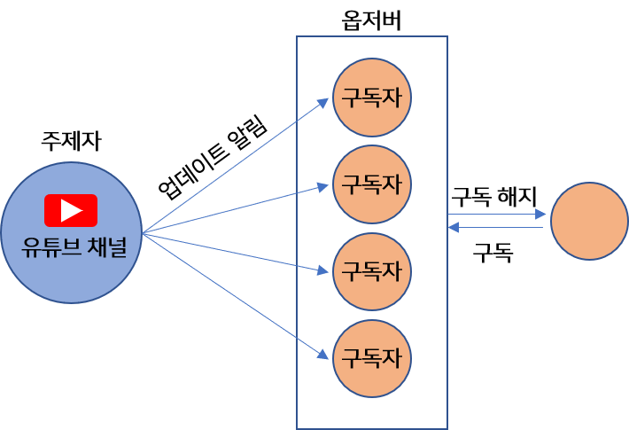
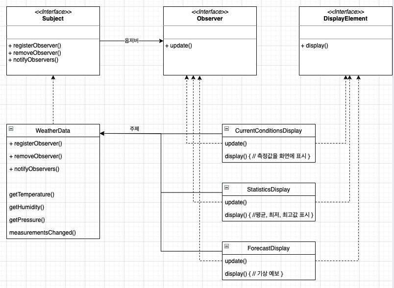

# 2. Observer Pattern
- 옵저버 패턴 : 한 객체의 상태가 바뀌면 그 객체에 의존하는 다른 객체에게 연락이 가고 자동으로 내용이 갱신되는 방식으로 일대 다 의존성을 정의
- 주제(Subject) : 상태를 저장하고 있는 객체
- 옵저버(Observer) : 주제에 의존하는 객체들

## 1. 특징
- 주제는 동시에 옵저버가 될 수도 있다
- 주제는 옵저버가 특정 인터페이스를 구현한다는 사실만 안다
- 옵저버는 언제든지 추가할 수 있다
- 새로운 형식의 옵저버를 추가할 때도 주제를 변경할 필요가 전혀 없다
- 주제와 옵저버는 서로 독립적으로 재사용 가능
- 주제나 옵저버가 달라져도 서로에게 영향을 미치지는 않는다
- 옵저버 패턴은 느슨한 결합을 보여주는 좋은 예시이다

## 2. 옵저버 패턴 작동 원리
- 주제에게 자기도 옵저버가 되고 싶다고 한다
- 옵저버가 된다
- 주제 값이 바뀌면 그 값을 옵저버들에게 전달한다
- 탈퇴를 원하면 탈퇴가 가능하다



## 3. 기상 스테이션 예시




### 주제
- 옵저버를 등록(register), 삭제(remove)하는 역할을 한다
- notifyObservers - 주제의 상태가 변경되었을 때 모든 옵저버에게 변경 내용을 알리기 위한 메소드

```java
public interface Subject {

    public void registerObserver(Observer o);
    public void removeObserver(Observer o);
    public void notifyObservers();
}
public interface Observer {

    void update(float temperature, float humidity, float pressure);
}
public interface DisplayElement {

    public void display();
}
```

### Subject 구현체
```java
public class WeatherData implements Subject {

    private float temperature;
    private float humidity;
    private float pressure;
    private List<Observer> observers;


    public WeatherData() {
        observers = new ArrayList<Observer>();
    }

    @Override
    public void registerObserver(Observer o) {
        observers.add(o);
    }

    @Override
    public void removeObserver(Observer o) {
        observers.remove(o);
    }

    @Override
    public void notifyObservers() {
        for(Observer observer: observers) {
            observer.update(temperature, humidity, pressure);
        }

    }

    public void measurementsChanged() {
        notifyObservers();
    }

    public void setWeatherData(float temperature, float humidity, float pressure) {
        this.temperature = temperature;
        this.humidity = humidity;
        this.pressure = pressure;

        measurementsChanged();
    }

    public float getTemperature() {
        return this.temperature;
    }

    public float getHumidity() {
        return this.humidity;
    }

    public float getPressure() {
        return this.pressure;
    }
}
```

### Observer 구현체
```java
public class CurrentConditionsDisplay implements Observer, DisplayElement {

    private float temperature;
    private float humidity;

    @Override
    public void update(float temperature, float humidity, float pressure) {
        this.temperature = temperature;
        this.humidity = humidity;

        display();
    }

    @Override
    public void display() {
        System.out.println("현재 상태:  온도 "+temperature+"F, 습도 "+humidity+"%");
    }
}
```
## 4. push pull
- 위 예시는 주제 데이터가 바뀌면 update() 를 호출하여 옵저버에 새로운 온도 습고 기압 데이터를 보냄
- 옵저버가 값변경을 알림받을때 게터 메서드를 호출하여 필요한 값을 pull 하게 변경하자

```java
    // WeatherData.java
    public void notifyObservers() {
        for(Observer observer: observers) {
            observer.update();
        }

    }
    
    
 
    // Observer.java
    public interface Observer {
    
    void update();
    }

    public void update() {
         this.temperature = weatherData.getTemperature();
         this.humidity = weatherData.getHumidity();

         display();
    }
```
